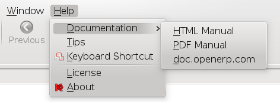
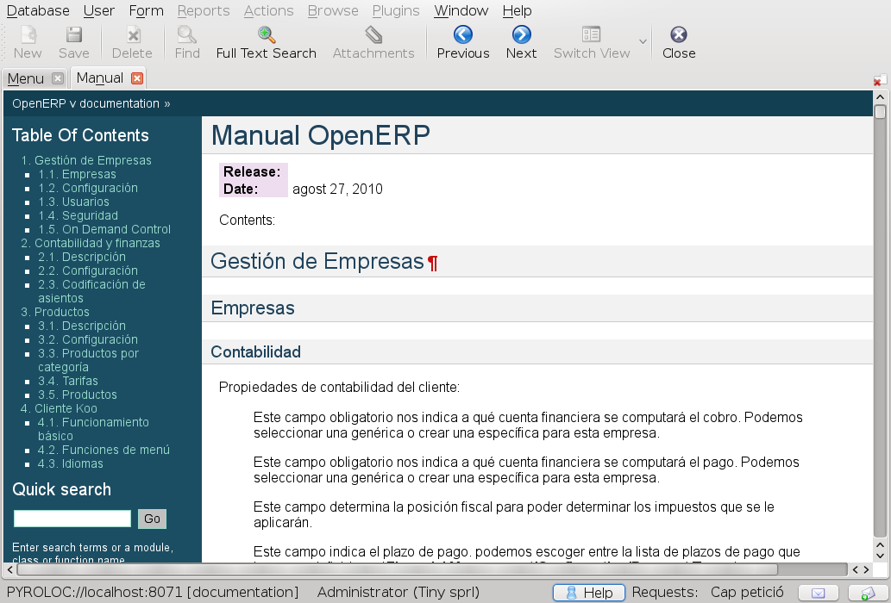
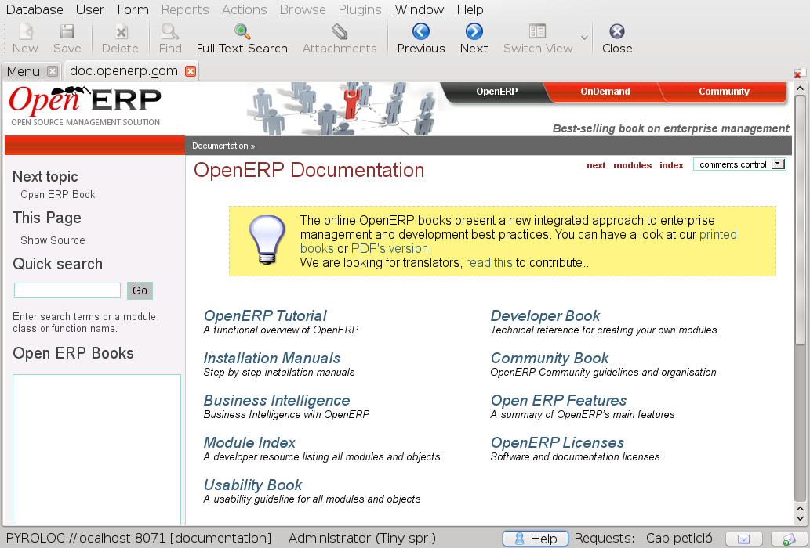
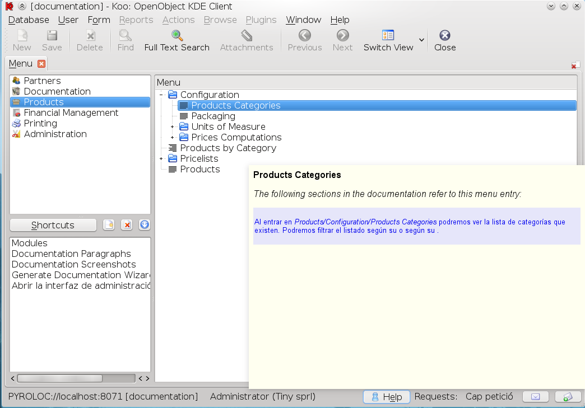
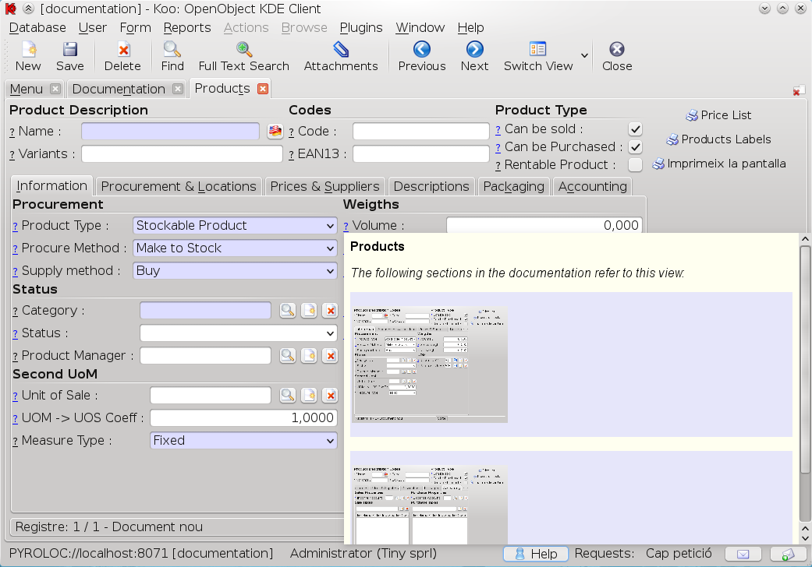
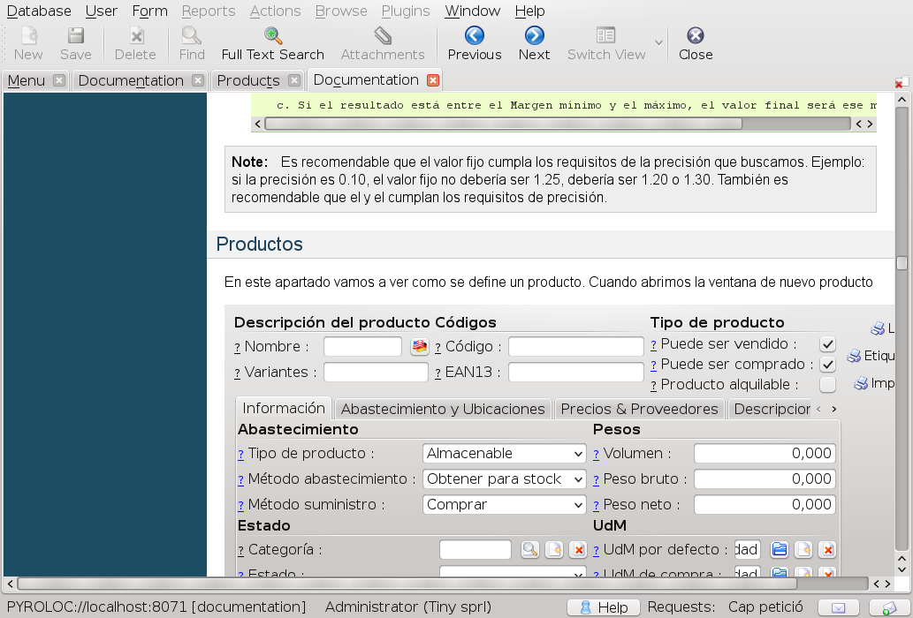
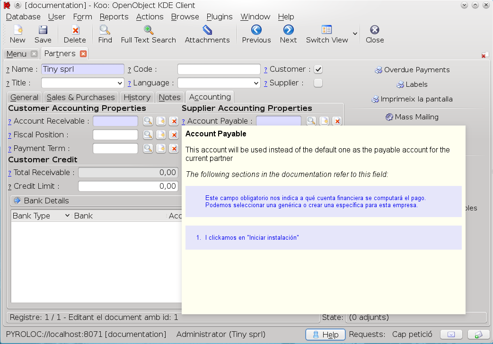
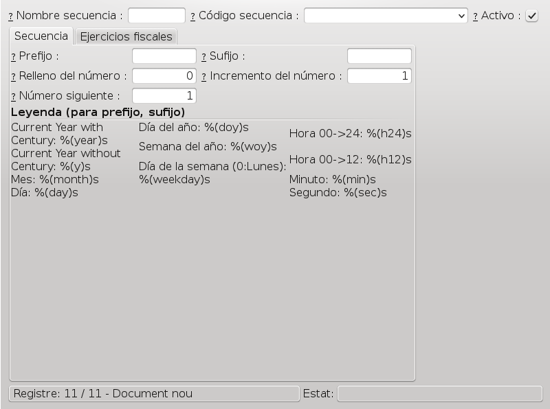
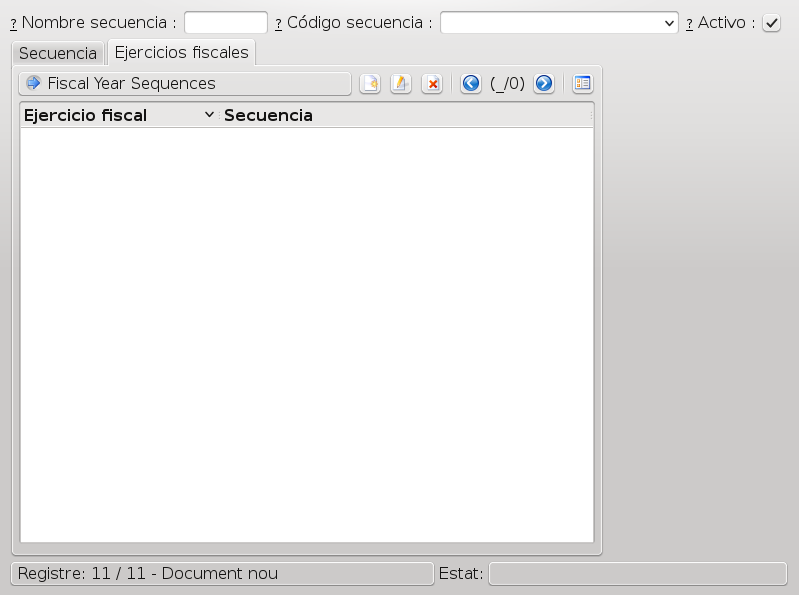

.. Copyright (C) 2010 - NaN Projectes de Programari Lliure, S.L.
..                      http://www.NaN-tic.com
.. Esta documentación está sujeta a una licencia Creative Commons Attribution-ShareAlike 
.. http://creativecommons.org/licenses/by-sa/3.0/

=============
Documentation
=============

The new documentation module aims to be a good companion for users, developers, documentation writers and translators. So let's see take a look at different aspects of the framework.

------------
How it looks
------------

First of all I'm going to show you how the documentation looks inside Koo and what it is possible with it. As I already mentioned, we hope Web and GTK clients will join the effort, so what we already have in Koo should be available in those clients too.

Let's start with the simple part. We have created three submenu options inside *Help/Documentation*.

The first one will open the documentation in a new tab in the application:

The second one will open the documentation in a PDF file that can later be printed. The content in both cases is exactly the same.

The last entry will open http://doc.openerp.com in a new tab in the application (press control key if you want it to be opened in your system's default browser):

As you can see. In the first and last options, the previous and next buttons (as well as reload) of the standard interface are used as the usual browser buttons. In fact, now URL actions are opened inside Koo by default (except if user presses control as already mentioned).

.. Note:: Although documentation will usually be HTML, you do not need to open any new ports in OpenERP because Koo will use your favorite protocol (XML-RPC, Net-RPC or Pyro) for loading HTML and images through a new internal protocol (openerp://).

Even if this is the way all of us are used when opening a manual it is hardly useful. If we wanted to read the whole manual we may print its PDF version, but that's it. Indeed, most usually we would find ourselves searching for information in it, like a field or a menu entry.

With the new framework, users will almost always open the manual using the new contextual interface. The idea is that users can view the parts of the manual that refer to the work they are doing at the moment. This has the advantage that documentation writers will write a single book with information structured as a book and that it can be read from the beginning until the end (like a book), but the documentation is ensured to be always useful because users will be directed to the sections they need when they need them.

The contextual interface is currently available in a couple places.

The first and the one users will notice first is the new Help button we have added at the status bar. This will provide help for both menu entries:

in which you can see the paragraphs in the documentation where the reference to the menu appears, and views:

in which you can see the places that have screenshots of the view. In both cases, users can click and see the appropriate section in the documentation:

The second place in which we have added contextual information is in fields. Until now, only fields with a tip had a question mark in them. Now we have added the question mark to all the fields (although those with a tip are shown in blue and those that don't have one are shown in black) and clicking on it displays not only the tip, but also all the places in the documentation where it is mentioned:

That's all we have implemented by now. Some other things we would like to introduce is being able to view the places where current state of the workflow of current document is mentioned so users can fully understand what 'open' invoice means, for example.

Although this is all user-oriented, we also think the framework should be used to include developer information and integrators could include all notes and documentation generated during the integration process for that customer. 

Note that the documentation will only show information relevant for the modules that are currently installed and screenshots look like what the user has, so if the user is in a group that cannot see some fields, they will not appear in their screenshot even if it appears for the rest of the users.

----------
Writing it
----------

Structure
=========

Each new module may have (hopefully we can make this a requirement) a *doc* directory and is written using sphinx syntax plus some extensions. This ensures documentation is near the code and developers feel comfortable with it, while being intelligible by documentation writers too. So it is expected that the *doc* directory will have one or more .rst files. Alternatively, if the module provides documentation for other modules it could have a *modules* subdirectory with the documentation of each of the modules it documents (don't worry if you need to read this sentence twice, it occurred to me and I wrote it ;-). For example, as we (at NaN) have no commit access to addons repository, we have created some documentation for *base*, *product* and *account* modules. In this case, if the module is called *addons_doc* the directory will look like this:

::

  addons_doc/doc/
  addons_doc/doc/modules/
  addons_doc/doc/modules/base/
  addons_doc/doc/modules/product/
  addons_doc/doc/modules/account/

Note that if a module provides documentation for other modules (and thus has the *doc/modules/* directory) any other file inside *doc/* will be just ignored. If we wanted to provide documentation for the *addons_doc* module itself, then we would add a new directory for it inside *addons_doc/doc/modules*.

I mentioned that the syntax of those files is sphinx plus some extensions. There are two kinds of extension tags: replacements and identifiers.

Replacements
------------

Replacements allow some information of the documentation to be filled in by content from the database the user is running. Currently the following three replacement types are implemented:

Fields
~~~~~~

With the following syntax:

::

  /// f: res.partner.name ///

It will replace the tag with the label of the field (*Name* in the example, with output in English). The reference to the field will be composed of the model and the field name separated with a dot. One can also print the help of the field with the following syntax:

::

  /// f: res.partner.name : help ///

In both cases, the system will create an anchor just before the current paragraph, so the system will be able to find this occurrence of the field in the generated HTML.

Menus
~~~~~

With the following syntax:

::

  /// m: base.menu_ir_sequence_form ///

It will replace the tag with the complete name of the menu (*Administration/Configuration/Sequence/Sequence* in the example, with output in English). The reference to the menu uses the model data that most developers are used to in view .xml files. This value is pretty easy to get in Koo by selecting the menu entry, clicking on switch view and then clicking on *Plugins/Search Model Data* menu on the top.

In this case, the system will also create an anchor just before the current paragraph, and in the future we will make it possible to open the menu entry from with the documentation itself.

Views
~~~~~

With the following syntax:

::
  
  /// v: base.sequence_view ///

It will replace the tag with a screenshot of the view. In this case it would replace it with this image:

Like in menus, the reference follows the model data syntax, although one can add one modifier:

::

  /// v: base.sequence_view : fiscal_ids ///

In this case, when the system will generate the screenshot, it will ensure the 'fiscal_ids' field it is shown even if it is not in the first tab. In this example, the image added would look like this:

Note that this is interesting because we do not know how many tabs there will be when the documentation is rendered or the field we're talking about may have been moved to another place.

Note that this feature does not disallow documentation writers the possibility of adding other screenshots or images. They should do that in the same way they would do with Sphinx and they will be properly rendered. The system will also ensure there are no collisions in filenames, so users should not worry about that either.

Example
~~~~~~~

With these explanations we can already understand a simple example that could serve as part of the documentation of the base module:

*index.rst*:

::

  
  OpenERP Manual
  ==============
  
  Contents:
  
  .. toctree::
    :maxdepth: 2
    :numbered:
  
    base.rst
    
As you can see *index.rst*, tells Sphinx to load *base.rst* file which could look like this:

::

  Configuration
  =============
  
  Sequences
  ---------
  
  In /// m: base.menu_ir_sequence_form /// you can manage sequences which allow 
  advanced users to determine how document numbers will be generated.
  
  /// v: base.sequence_view ///

Identifiers
-----------

They follow this syntax:

::

  ||| identifier_name_that I want |||
  Here it starts the paragraph we want to have this identifier.

And they should go at the beginning of a paragraph (the paragraph itself should start at the next line or the next non-empty line).

Identifier tags allow giving each paragraph an ID, similar to what developers do with views, but in this case it is not required. If documentation writers do not provide an identifier for a paragraph, a default one will be created by the system automatically. To created it the system will use the first words of the paragraph (and a number if necessary) to ensure the ID is unique in its module.

Identifiers can also follow this syntax:

::

  ||| : after : base.base_rst |||
    product.rst
   
(in which the identifier of the paragraph will be created automatically) or this one:

::

  ||| add_product_rst : after : base.base_rst |||
    product.rst

In both cases we're telling the system to add the paragraph (which in this case simply contains '   product.rst') just after the paragraph with identifier *base.base_rst*. That is, the paragraph with ID *base_rst* in module *base*. If you take a look at the example above you will realize that here we're adding a new *product.rst* file to the *index.rst* file created by *base* module. As you may have guessed, the idea is that this documentation will be part of the *product* module.

The placement part of the identifier tag can currently be any of *before*, *after* (which will create new paragraphs, and thus add an empty line between the new paragraph and the inherited one), *prepend*, *append* (which will not create new paragraphs) and *replace*.

This inheritance mechanism gives great flexibility and allows avoiding the *if's* issue I mentioned in my last blog post, but as we need paragraphs as a reference, we should take this a little bit into account when writing documentation. For example, in Sphinx one can write a definition list like this:

::

  word1
    explanation 1
  word2
    explanation 2
    
or like this:

::

  word1
    explanation 1
    
  word2
    explanation 2

Both are correct in Sphinx and in this framework, but the latter gives more flexibility if someone writes a new module and needs to add a new entry between *word1* and *word2*.

Because original identifiers can change over time if not set manually (because the first words of the paragraph may be changed), we plan to allow the system to store the automatically generated IDs into original .rst files, so documentation writers can freely fix typos or restructure sentences without breaking documentation of other dependent modules and also freeing them of the task of having to create a unique ID per paragraph.

Apart from knowing a little bit of Sphinx, this is all you need to know to write documentation for this framework. 

------------
How it works
------------

In the previous section we explained that documentation will be inside the modules, very near the source code. Here we will explain what the system does and what are the steps to import and render the documentation. 

After installing the *documentation* module in OpenERP you will realize that a new *Documentation* entry appears in the main menu. The first thing you should do is execute the *Import Documentation Wizard*. This will check the *doc/* directory of all modules and import .rst files paragraph by paragraph into OpenERP database. As mentioned above, the system considers that a paragraph ends and a new one starts after each empty line.

Once paragraphs have been imported you can see them in *Documentation Paragraphs* menu entry. You should go there, select all paragraphs and execute the *Plugins/Create Screenshots* action in the menu above (no need to say what this will do, I guess):

Then we can execute the *Generate Documentation Wizard* and we have the documentation ready to be used.

--------------
Translating it
--------------

The import wizard will add a record into *ir.data.model* for each paragraph. This simply means that if you try to create a translation template .pot file for a given module it will also export the documentation: easy.

The translation process is also simplified by the fact that the original writer already used tags to refer to menus and fields so the translator does not have to worry about what were the exact names given to those items for her language. The same goes to screenshots, as they will be automatically generated for user's language in each install.

----------
The future
----------

We have already mentioned some of the things we would like to improve, such as references to workflows and their activities or opening menu entries from within the documentation itself. Some other things we have in mind include:

- Do not force users to enter the Paragraphs section and select all of them to create screenshots.
- Regenerate the documentation when needed without the user noticing asking for it.
- Integrate documentation import with module installation so import process becomes unnecessary.
- Allow users to add their own notes inside the documentation because they tend to use their own words and have their own processes.
- Add an appendix with technical information of the modules installed in the system.
